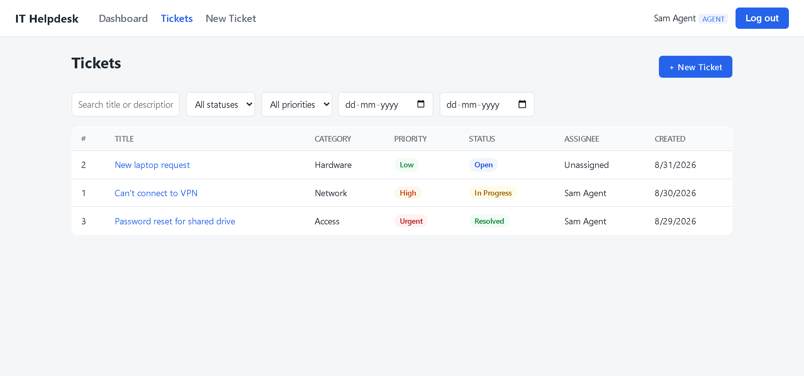
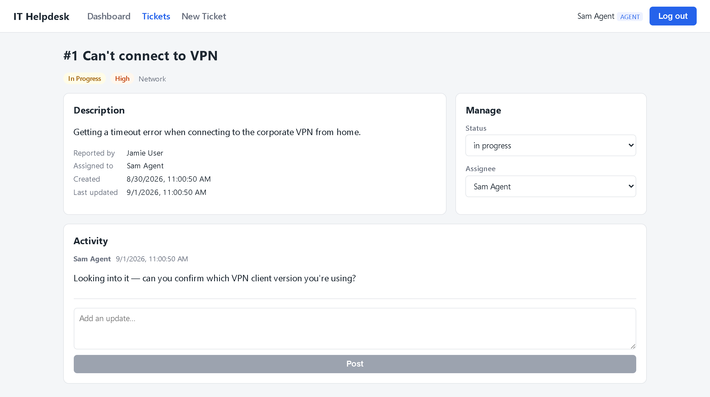
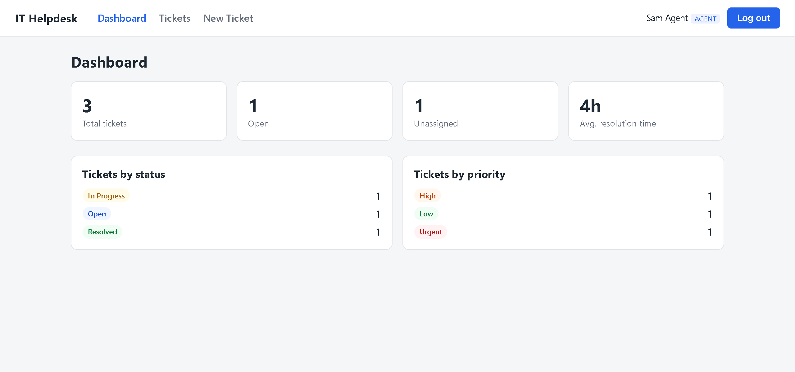

# IT Helpdesk

**A support ticketing system with server-enforced role-based access** — the
kind of tool a service desk actually runs on, built to understand how one
works from the inside.

[](https://github.com/chanllawala/it-helpdesk/actions/workflows/deploy.yml)




### ▶ [Try it live](https://it-helpdesk-frontend-3lpf.onrender.com) · [Interactive API docs](https://it-helpdesk-backend-5s1n.onrender.com/docs)

Sign in as any of these — **the role changes what you can see and do**, which
is the point worth clicking through:

| Email | Password | Role | What they get |
| --- | --- | --- | --- |
| `agent@helpdesk.example` | `agent123` | agent | Every ticket, plus assign and status controls |
| `user@helpdesk.example` | `user123` | user | Only their own tickets; no management panel |
| `admin@helpdesk.example` | `admin123` | admin | Everything |

> Render's free tier sleeps after ~15 minutes idle — the first request can take
> 30–60 seconds to wake it.

---

## What it does

A full ticket lifecycle: create with priority and category, assign to an
agent, move through Open → In Progress → Resolved → Closed, and discuss it on
a per-ticket comment thread. Plus a metrics dashboard, notification events on
every change, and search and filtering by status, priority, assignee, date
range and free text.

**The ticket view** — description, metadata, the agent's management panel, and
the comment thread that gives each case an audit history:



**The dashboard** — counts by status and priority, and an average resolution
time computed from real timestamps:



## Stack

- **Backend:** FastAPI + SQLAlchemy, JWT auth (`python-jose` +
  `passlib`/`bcrypt`); SQLite locally, PostgreSQL in production
- **Frontend:** React + TypeScript + Vite, React Router
- **Deploy:** Render, provisioned from [`render.yaml`](render.yaml) as
  infrastructure-as-code (web service + static site + managed Postgres)
- **Also deployable to AWS:** S3 + CloudFront for the frontend, ECS on EC2 for
  the API, RDS PostgreSQL for data, all defined in Terraform under
  [`infra/`](infra/) and deployed by GitHub Actions using keyless OIDC auth.
  See [`infra/README.md`](infra/README.md) for the architecture and the
  mixed-content problem that shaped it.

## What this demonstrates

- **Role-based access control** enforced server-side, not just hidden in the
  UI — a standard user's ticket list is filtered in the query itself, and the
  assign/status endpoints reject non-staff with a 403.
- **A realistic support workflow** — status transitions record `resolved_at` /
  `closed_at` timestamps, which is what makes the dashboard's average
  resolution time a real measurement rather than a decorative number.
- **An auditable history** — every ticket carries its own comment thread, the
  way a real service desk keeps correspondence attached to the case.
- **Tested where it matters** — 17 API tests weighted toward the access-control
  rules. One user reading another's tickets is not a bug you want to find in
  production.

## Regenerating the screenshots

The app is behind a login, so the images above are captured by a script that
signs in first:

```bash
pip install playwright
python docs/screenshots.py            # needs the app running locally
```

## Backend

```bash
cd backend
python -m venv venv
./venv/Scripts/pip install -r requirements.txt   # Windows
# source venv/bin/activate && pip install -r requirements.txt   # macOS/Linux
cp .env.example .env
./venv/Scripts/python -m app.seed                # creates demo users + tickets
./venv/Scripts/python -m uvicorn app.main:app --reload --port 8000
```

API docs at `http://127.0.0.1:8000/docs`.

Demo accounts (seeded): `admin@helpdesk.example` / `admin123`,
`agent@helpdesk.example` / `agent123`, `user@helpdesk.example` / `user123`.

## Frontend

```bash
cd frontend
npm install
cp .env.example .env
npm run dev
```

Runs at `http://localhost:5173` and talks to the API at
`VITE_API_URL` (defaults to `http://127.0.0.1:8000`).

## Roles

- **user** — creates tickets, sees and comments on their own tickets.
- **agent** — sees all tickets, gets assigned tickets, changes status,
  assigns tickets to other agents/admins.
- **admin** — same as agent, plus is the only role that can be granted at
  registration (the very first registered user becomes admin; everyone after
  that registers as a standard user).

## Notes

- SQLite is used for local dev (`backend/helpdesk.db`); swap `DATABASE_URL`
  in `backend/.env` for a Postgres URL to run against Postgres. Render-style
  `postgres://` URLs are rewritten to `postgresql://` automatically, since
  SQLAlchemy 2.x dropped the older scheme.
- The deployed backend seeds demo data on boot. Seeding is idempotent — it
  no-ops once users exist — which is how the demo accounts reach the
  production database, as Render's Shell and Jobs features are paid-only.
- "Notifications" are simulated: each ticket create/assign/status
  change/comment writes a row to the `notifications` table and prints to
  stdout, standing in for a real email/Slack integration.
